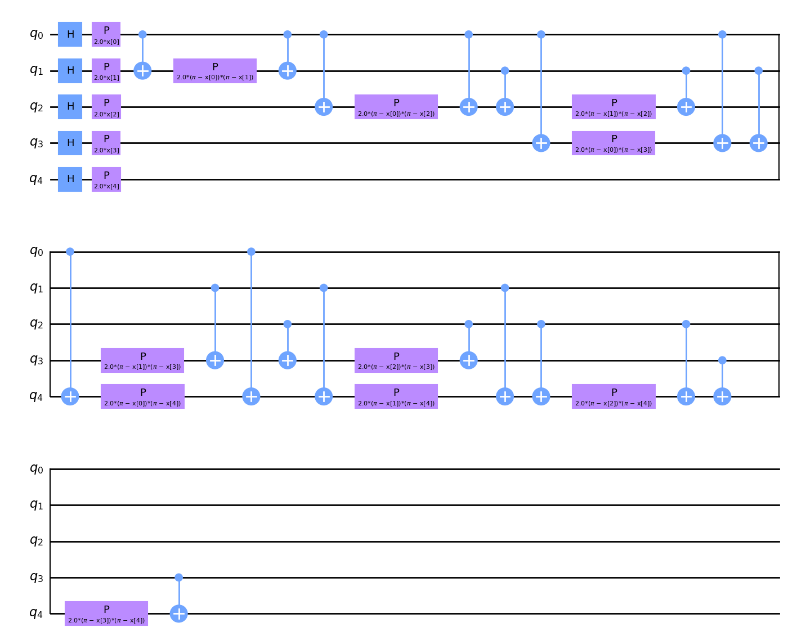
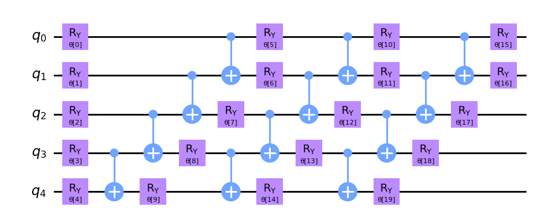

# Quantum Computing
Bu yazıda genel hatlarıyla kodların açıklaması olacak Standart bir makine öğrenmesinin detayları yer almayacak sadece yazılmış QUANTUM VARIATIONAL CLASSIFIER (QVC) detayları olacak. Yazı sonunda ise bazı analizler olacak. Temel bilgileri edinmek için pdf'i okuyabilirsiniz.
## QVC NEDİR


## Kodların Detayları
Kuantum hesaplama ve sınıflandırma yapabilmek için öncelikle kesinlikle ön işleme(pre-processing ) yapılmalıdır. Bu kısımda herhangi bir makine öğrenmesinde kullanılan tüm ön işlemeler yapılmıştır. Scaling, Data Seperation vs. ilgili kodların fonksiyon başlıkları aşağıda yer almaktadır

`load_data()`
`minimize_rows(data, index,name)`
`encoding_and_creating_sets_for_x(data)`
`make_y(y)`
`missing_values(x)`
`scaling_data(x)`
`y_encoding(y)`

## QVC Fonksiyonu
### QVC NASIL ÇALIŞIR

```
def quantum_algorithm(x_train, y_train, x_test, y_test)
```


```
num_features = x_train.shape[1]
feature_map = ZZFeatureMap(feature_dimension=num_features, reps=1)
feature_map.decompose().draw(output="mpl", style="clifford", fold=20)

```
`num_features` Eğitim veri kümesindeki özellik sayısı (kolon sayısı), kuantum devrelerinin boyutunu tanımlamak için kullanılır.

Bir `ZZFeatureMap`, klasik verileri kuantum özellik uzayına eşlemek için kullanılır. `reps` parametresi, özellik haritasının kaç kez tekrar edileceğini belirler.


`feature_map.decompose()` Bu metod, `feature_map` olarak adlandırılan kuantum devresini daha temel kapılara ayırır. Örneğin, karmaşık kapılar yerine sadece CNOT ve tekli qubit kapıları gibi daha basit kapılarla temsil edilen bir devre oluşturur. Bu, devrenin nasıl çalıştığını ve hangi kapıları içerdiğini daha ayrıntılı bir şekilde anlamayı sağlar. Bu kodun feature_map'i aşağıda yer almaktadır.




```
ansatz = RealAmplitudes(num_qubits=num_features, reps=3)
ansatz.decompose().draw(output="mpl", style="clifford", fold=20)
```


`RealAmplitudes` ansatz, kuantum durumunu parametreleştiren kuantum devresini oluşturmak için kullanılır. `reps` parametresi, ansatz devresinin kaç kez tekrar edileceğini belirtir.
`ansatz.decompose()` ile ansatz devresinin resmi çizilir . Bu kodun şeması aşağıdadır 



`optimizer = COBYLA(maxiter=100)`

Bu satır, COBYLA (Constrained Optimization BY Linear Approximations) adında bir optimizasyon algoritmasının bir örneğini oluşturur ve optimizer değişkenine atar.
COBYLA, kısıtlı optimizasyon problemlerini çözmek için kullanılan bir algoritmadır. Kısıtlar doğrusal olmasa bile kullanılabilir.
`maxiter=100` parametresi, algoritmanın en fazla 100 iterasyon yapmasına izin verir. Yani, çözüm ararken en fazla 100 adım atar. Bu, algoritmanın çalışma süresini kontrol etmek ve aşırı uzun çalışmasını engellemek için kullanılır.
`sampler = Sampler()`

Bu satır, kuantum devresinden örnekler almak için kullanılan bir örnekleyiciyi (sampler) oluşturur ve sampler değişkenine atar.
Sampler, belirli bir kuantum devresi üzerinde çalışarak ölçüm sonuçlarını elde eden bir sınıftır. Kuantum bilgisayarlar, belirli bir durumdan örnekler alarak bu durumun olasılık dağılımını belirler.

Bu örnekleyici, bir kuantum devresinin çalıştırılması ve sonrasında ölçüm sonuçlarının alınması süreçlerini kapsar.

`plt.rcParams["figure.figsize"] = (12, 6)`

Bu satır, Matplotlib kütüphanesi kullanılarak çizilecek grafiklerin boyutunu ayarlar.

```
def callback_graph(weights, obj_func_eval):
        clear_output(wait=True)
        objective_func_vals.append(obj_func_eval)
        plt.title("Objective function value against iteration")
        plt.xlabel("Iteration")
        plt.ylabel("Objective function value")
        plt.plot(range(len(objective_func_vals)), objective_func_vals)
        plt.show()

```

Bu kod, bir optimizasyon süreci sırasında amaç fonksiyonunun değerlerini çizmek için bir geri çağırma (callback) fonksiyonu tanımlar. İşte kodun her bir bölümünün açıklaması:

`def callback_graph(weights, obj_func_eval)`

Bu satır, `callback_graph` adında bir fonksiyon tanımlar. Bu fonksiyon, optimizasyon süreci sırasında çağrılır ve her iterasyonda amaç fonksiyonunun değerlerini grafik olarak çizer.
`weights` Bu parametre, optimizasyon sürecinde kullanılan ağırlıkları temsil eder. Bu parametre bu fonksiyonda kullanılmasa da, optimizasyon algoritmalarının standart bir parçasıdır ve bu nedenle genellikle geri çağırma fonksiyonlarına geçirilir.
`obj_func_eval` Bu parametre, mevcut iterasyonda hesaplanan amaç fonksiyonunun (objective function) değeridir.
`clear_output(wait=True)`

Bu, Jupyter Notebook'ta çıktıyı temizlemek için kullanılır. `wait=True` parametresi, yeni bir çıktı hazır olana kadar temizleme işlemini bekler. Bu, sürekli olarak güncellenen grafikleri daha düzgün bir şekilde görüntülemeye yardımcı olur.
`objective_func_vals.append(obj_func_eval)`

Bu satır, mevcut iterasyonun amaç fonksiyonunun değerini `(obj_func_eval)` objective_func_vals listesine ekler. Bu liste, her iterasyonda amaç fonksiyonunun değerlerini saklar, böylece optimizasyon sürecinin ilerlemesi izlenebilir.
`plt.title("Objective function value against iteration")`

Bu, grafiğin başlığını ayarlar. Burada başlık, "Objective function value against iteration" olarak belirlenmiştir, bu da grafikte gösterilecek bilgiyi açıklar.
`plt.xlabel("Iteration")`

X ekseninin etiketini `"Iteration"` olarak ayarlar. Bu eksen, optimizasyon sürecinin iterasyon sayısını temsil eder.
`plt.ylabel("Objective function value")`

Y ekseninin etiketini `"Objective function value"` olarak ayarlar. Bu eksen, amaç fonksiyonunun her iterasyonda elde edilen değerini temsil eder.
`plt.plot(range(len(objective_func_vals)), objective_func_vals)`

Bu, grafiği çizer. X ekseni için iterasyon numaralarını `(range(len(objective_func_vals)))`, Y ekseni için ise bu iterasyonlardaki amaç fonksiyonu değerlerini `(objective_func_vals)` kullanır.
`plt.show()`

Grafiği görüntüler. Bu, Jupyter Notebook'ta veya diğer ortamda grafiğin ekranda gösterilmesini sağlar.
Bu geri çağırma fonksiyonu, optimizasyon süreci sırasında çağrılır ve her iterasyonda amaç fonksiyonunun değerinin nasıl değiştiğini görsel olarak izlemenizi sağlar. Bu, optimizasyon sürecinin ilerlemesini ve başarısını anlamak için kullanışlıdır.

```
 vqc = VQC(sampler=sampler,feature_map=feature_map,ansatz=ansatz,optimizer=optimizer,callback=callback_graph,)

    # clear objective value history
    objective_func_vals = []

    start = time.time()
    print("Learning is started")
    vqc.fit(x_train, y_train)
    elapsed = time.time() - start

    print(f"Training time: {round(elapsed)} seconds")

    train_score_q4 = vqc.score(x_train, y_train)
    test_score_q4 = vqc.score(x_test, y_test)

```
Bu kod parçaları, Qiskit kullanılarak bir Variational Quantum Classifier (VQC) modelinin oluşturulması, eğitilmesi ve değerlendirilmesi süreçlerini göstermektedir. İşte kodun her bir bölümünün açıklaması:

`vqc = VQC(sampler=sampler, feature_map=feature_map, ansatz=ansatz, optimizer=optimizer, callback=callback_graph)`

Bu satır, VQC (Variational Quantum Classifier) sınıfından bir model oluşturur ve vqc değişkenine atar.
`sampler:` Kuantum devresinden ölçüm sonuçlarını almak için kullanılan örnekleyici. Daha önce `Sampler()` olarak tanımlanmıştı.
`feature_map` Giriş verilerini kuantum durumlarına kodlamak için kullanılan özellik haritası `(feature map)`. Bu, klasik verilerin kuantum bilgisayarda işlenebilir hale getirilmesini sağlar.
ansatz: Kuantum devresinin belirli bir parametre setiyle yapılandırılması. Bu, modelin öğrenme kapasitesini belirler ve parametreleri öğrenme sürecinde optimize edilir.
optimizer: Öğrenme sürecinde ansatz parametrelerini optimize etmek için kullanılan optimizasyon algoritması. Burada `COBYLA` kullanılmıştır.
`callback=callback_graph` Eğitim süreci sırasında belirli adımlarda çağrılacak olan geri çağırma fonksiyonu. Bu, her iterasyonda amaç fonksiyonunun değerlerini izlemek ve çizmek için kullanılır.
`objective_func_vals = []`

Bu satır, objective_func_vals listesini temizler. Eğitim süreci başlamadan önce amaç fonksiyonu değerlerinin geçmişini siler. Bu, yeni bir eğitim süreci için sıfırdan başlamayı sağlar.
`start = time.time()`

Bu, eğitim sürecinin başlangıç zamanını kaydeder. Zamanı ölçmek için kullanılır.

`vqc.fit(x_train, y_train)`

Bu, vqc modelini `x_train` ve `y_train` verileri üzerinde eğitir. `x_train`, giriş özelliklerini, `y_train` ise bu özelliklere karşılık gelen etiketleri temsil eder. fit fonksiyonu, modeli bu veriler üzerinde eğitir ve parametreleri optimize eder.
`elapsed = time.time() - start`

Bu, eğitim sürecinin ne kadar sürdüğünü hesaplar. Başlangıç zamanından itibaren geçen süreyi elapsed değişkenine atar.

`train_score_q4 = vqc.score(x_train, y_train)`

Bu, modelin eğitim verisi üzerindeki başarımını `(accuracy)` ölçer ve `train_score_q4` değişkenine atar. score fonksiyonu, modelin tahminlerinin doğruluğunu hesaplar.
`test_score_q4 = vqc.score(x_test, y_test)`

Bu, modelin test verisi üzerindeki başarımını `(accuracy)` ölçer ve `test_score_q4` değişkenine atar. Test verisi, modelin eğitimde görmediği verilerden oluşur ve modelin genelleme yeteneğini değerlendirir.
Bu kod, bir VQC modelini eğitmek ve değerlendirmek için tam bir akış sağlar. Eğitim süresi ve modelin eğitim ve test setleri üzerindeki performansı ölçülür.